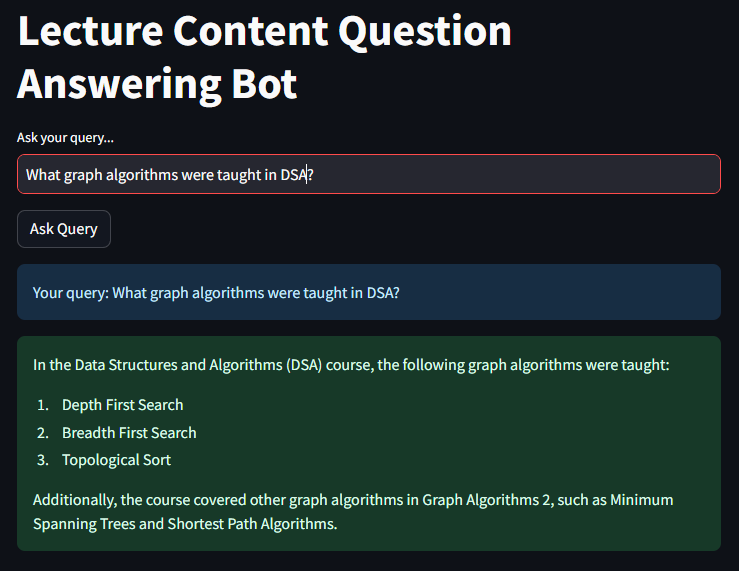
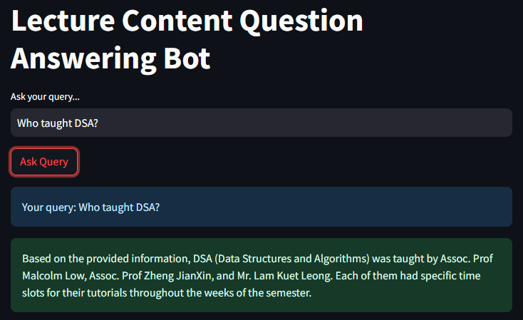

<a name="readme-top"></a>

<!-- PROJECT SHIELDS -->
[![Contributors][contributors-shield]][contributors-url]
[![Forks][forks-shield]][forks-url]
[![Stargazers][stars-shield]][stars-url]
[![Issues][issues-shield]][issues-url]
[![MIT License][license-shield]][license-url]

<!-- PROJECT LOGO -->
<br />
<div align="center">

<h2 align="center">Lecture Content Document-based Question Answering RAG Chatbot</h2>

  <p align="center">
    An LLM Chatbot application that answers students' queries based on the contents of their past lecture materials.
    <br />
    <a href="https://github.com/DerrickLJH2000/lecture-content-chatbot"><strong>Explore the docs »</strong></a>
  </p>
</div>


<!-- TABLE OF CONTENTS -->
<details>
  <summary>Table of Contents</summary>
  <ol>
    <li>
      <a href="#project-background">Project Background</a>
    </li>
    <li>
      <a href="#project-description">Product Description</a>
      <ul>
        <li><a href="#built-with">Built With</a></li>
      </ul>
    </li>
    <li>
      <a href="#getting-started">Getting Started</a>
      <ul>
        <li><a href="#prerequisites">Prerequisites</a></li>
        <li><a href="#installation">Installation</a></li>
      </ul>
    </li>
    <li><a href="#usage">Usage</a></li>
  </ol>
</details>


<!-- Project Background -->
## Project Background

Students tend to look back at their lecture materials in modules that they have done before as reference, but often times it can be difficult to dig out specifically what is needed. To address this challenge, I have developed a Document-based Question Answering RAG application that answers the students questions based on the documents containing all of the student’s previous modules retrieved from its vector database. 
<p align="right">(<a href="#readme-top">back to top</a>)</p>

<!-- Product Description -->
## Product Description
The Lecture Content Chatbot leverages:
<ol>
  <li>Langchain, a framework to construct LLM-powered applications,</li>
  <li>Pinecone, a Vector Database to store all documents as vector embeddings,</li>
  <li>OpenAI, a Large Language Model that the application utlized</li>
  <li>and Streamlit, an open-source framework to rapidly build machine learning and data science web applications used for our user interface.</li>
<ol>

<p align="right">(<a href="#readme-top">back to top</a>)</p>


### Built With

[![Python][Python]][Python-url] [![Langchain][Langchain]][Langchain-url] [![OpenAI][OpenAI]][OpenAI-url] [![Pinecone][Pinecone]][Pinecone-url] [![Streamlit][Streamlit]][Streamlit-url]


<p align="right">(<a href="#readme-top">back to top</a>)</p>


<!-- GETTING STARTED -->
## Getting Started

This is an example of how you may give instructions on setting up your project locally.
To get a local copy up and running follow these simple example steps.

### Prerequisites

This is an example of how to list things you need to use the software and how to install them.
* Install packages with pip
  ```sh
  pip install -r requirements.txt
  ```

### Installation (WIP)

1. Clone the repository:
   ```sh
   git clone https://github.com/DerrickLJH/EmotionBasedMusicRecommender.git
   ```
   
<!-- USAGE EXAMPLES -->
## Sample Usage

<div style="display:flex;">
  
  
</div>

<p align="right">(<a href="#readme-top">back to top</a>)</p>


<!-- MARKDOWN LINKS & IMAGES -->
<!-- https://www.markdownguide.org/basic-syntax/#reference-style-links -->
[contributors-shield]: https://img.shields.io/github/contributors/DerrickLJH2000/lecture-content-chatbot.svg?style=for-the-badge
[contributors-url]: https://github.com/DerrickLJH2000/lecture-content-chatbot/graphs/contributors
[forks-shield]: https://img.shields.io/github/forks/DerrickLJH2000/lecture-content-chatbot.svg?style=for-the-badge
[forks-url]: https://github.com/DerrickLJH2000/lecture-content-chatbot/network/members
[stars-shield]: https://img.shields.io/github/stars/DerrickLJH2000/lecture-content-chatbot.svg?style=for-the-badge
[stars-url]: https://github.com/DerrickLJH2000/lecture-content-chatbot/stargazers
[issues-shield]: https://img.shields.io/github/issues/DerrickLJH2000/lecture-content-chatbot.svg?style=for-the-badge
[issues-url]: https://github.com/DerrickLJH2000/lecture-content-chatbot/issues
[license-shield]: https://img.shields.io/github/license/DerrickLJH2000/lecture-content-chatbot.svg?style=for-the-badge
[license-url]: https://github.com/DerrickLJH2000/lecture-content-chatbot/blob/main/LICENSE.txt
[Python]: https://img.shields.io/badge/Python-3670A0?style=for-the-badge&logo=python&logoColor=ffdd54
[Python-url]: https://www.python.org/
[Langchain]: https://img.shields.io/badge/Langchain-FFFFFF?style=for-the-badge&logo=Langchain&logoColor=black
[Langchain-url]: https://www.langchain.com/
[OpenAI]: https://img.shields.io/badge/OpenAI-74aa9c.svg?style=for-the-badge&logo=OpenAI&logoColor=white
[OpenAI-url]: https://openai.com/
[Pinecone]: https://img.shields.io/badge/Pinecone-FFFFFF?style=for-the-badge&logo=Pinecone&logoColor=black
[Pinecone-url]: https://www.pinecone.io/
[Streamlit]: https://img.shields.io/badge/Streamlit-FF4B4B?style=for-the-badge&logo=streamlit&logoColor=white
[Streamlit-url]: https://streamlit.io/

[product-screenshot1]: assets/sample1.png
[product-screenshot2]: assets/sample2.png
